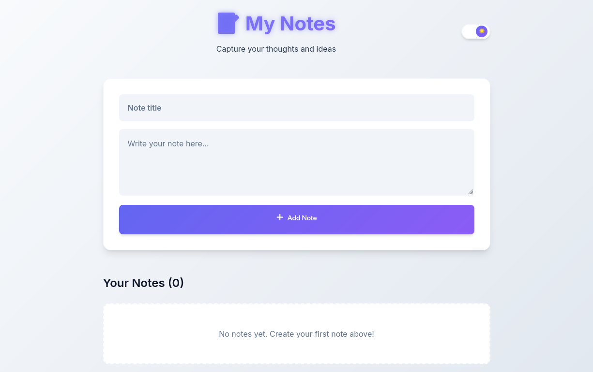
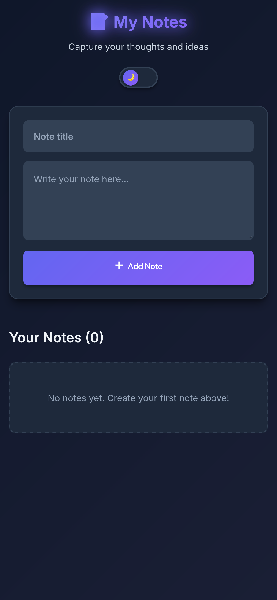

# 📝 Note Flow

<div align="center">


**A beautiful, feature-rich note-taking application built with modern web technologies**

[](https://note-flow.gouranga.qzz.io/)
[](https://stackblitz.com/github.com/GourangaDasSamrat/Note-Flow-App)
[](https://deepwiki.com/GourangaDasSamrat/Note-Flow-App)

[](https://www.typescriptlang.org/)
[](https://reactjs.org/)
[](https://vitejs.dev/)
[](LICENSE)

[Features](#-features) • [Demo](#-demo) • [Installation](#-installation) • [Usage](#-usage) • [Contributing](#-contributing) • [License](#-license)

</div>

---

## 🌟 Overview

**Note Flow** is a modern, lightweight note-taking application that prioritizes user experience with smooth animations, intuitive design, and powerful features. Built entirely with **vanilla CSS** (no UI libraries), it showcases custom-built components including modals, theme toggles, and interactive elements—all crafted from scratch.

### 🎯 Why Note Flow?

- ✨ **Zero CSS Libraries** - All animations, modals, and components built with pure CSS
- 🎨 **Modern Design** - Contemporary UI with smooth transitions and micro-interactions
- 🌓 **Theme Support** - Beautiful dark and light themes with seamless switching
- 💾 **Persistent Storage** - Never lose your notes with localStorage integration
- 📱 **Fully Responsive** - Perfect experience on desktop, tablet, and mobile
- ♿ **Accessible** - WCAG compliant with keyboard navigation support
- ⚡ **Lightning Fast** - Built with Vite for optimal performance
- 🔒 **Type Safe** - Full TypeScript implementation

---

## ✨ Features

### Core Functionality

- 📝 **Create Notes** - Quick note creation with title and body
- 👁️ **View Notes** - Full-screen modal view for reading notes
- ✏️ **Edit Notes** - In-place editing with confirmation dialogs
- 🗑️ **Delete Notes** - Safe deletion with confirmation prompts
- 💾 **Auto-Save** - Automatic localStorage persistence

### UI/UX Excellence

- 🎭 **Custom Modals** - Hand-crafted modal system with nested confirmations
- 🌓 **Theme Toggle** - Smooth dark/light mode switching with preference persistence
- ✨ **Smooth Animations** - Fade, slide, scale, and glow effects throughout
- 🎨 **Modern Color Palette** - Carefully selected colors for optimal readability
- 📊 **Empty States** - Helpful messages when no notes exist
- ⌨️ **Keyboard Support** - Full keyboard navigation and shortcuts

### Developer Experience

- 📦 **Modular Architecture** - Clean component separation
- 🔧 **Custom Hooks** - Reusable `useLocalStorage` hook
- 📘 **TypeScript** - Full type safety across the application
- 🎯 **Best Practices** - Follows React and TypeScript conventions
- 📝 **Well Documented** - Clear code comments and documentation

---

## 🚀 Demo

### Live Application

🌐 **[View Live Demo](https://note-flow.gouranga.qzz.io/)**

### Try it Online

💻 **[Open in StackBlitz](https://stackblitz.com/github.com/GourangaDasSamrat/Note-Flow-App)**

### Detailed Documentation

📚 **[Read Full Documentation](https://deepwiki.com/GourangaDasSamrat/Note-Flow-App)**

---

## 📸 Screenshots

<div align="center">

### Dark Theme


### Light Theme



### Mobile View



</div>

---

## 🛠️ Tech Stack

| Technology       | Purpose                 |
| ---------------- | ----------------------- |
| **React 18**     | UI Framework            |
| **TypeScript**   | Type Safety             |
| **Vite**         | Build Tool & Dev Server |
| **CSS3**         | Styling (No Libraries!) |
| **localStorage** | Data Persistence        |

---

## 📦 Installation

### Prerequisites

- Node.js (v16 or higher)
- npm or yarn or pnpm

### Clone Repository

```bash
# Clone the repository
git clone https://github.com/GourangaDasSamrat/Note-Flow-App.git

# Navigate to project directory
cd Note-Flow-App
```

### Install Dependencies

```bash
# Using npm
npm install

# Or using yarn
yarn install

# Or using pnpm
pnpm install
```

### Development Server

```bash
# Start development server
npm run dev

# Application will be available at http://localhost:5173
```

### Build for Production

```bash
# Create production build
npm run build

# Preview production build
npm run preview
```

---

## 📁 Project Structure

```
Note-Flow-App/
├── src/
│   ├── components/          # React components
│   │   ├── Header.tsx       # App header with theme toggle
│   │   ├── Modal.tsx        # Custom modal system
│   │   ├── NoteForm.tsx     # Note creation form
│   │   ├── NoteItem.tsx     # Individual note card
│   │   ├── NoteList.tsx     # Notes list container
│   │   └── ThemeToggle.tsx  # Theme switcher component
│   ├── hooks/               # Custom React hooks
│   │   └── useLocalStorage.tsx  # localStorage hook
│   ├── types/               # TypeScript type definitions
│   │   └── index.ts         # Shared interfaces
│   ├── App.tsx              # Main app component
│   ├── App.css              # Global styles (Pure CSS!)
│   ├── main.tsx             # Application entry point
│   └── index.css            # Base styles
├── public/                  # Static assets
├── package.json             # Dependencies
├── tsconfig.json            # TypeScript config
├── vite.config.ts           # Vite configuration
├── CONTRIBUTING.md          # Contribution guidelines
├── CODE_OF_CONDUCT.md       # Code of conduct
└── README.md                # This file
```

---

## 🎨 Custom Components & Animations

### What Makes Note Flow Special

Note Flow stands out by implementing **every UI component from scratch using pure CSS**. No Bootstrap, no Material-UI, no Tailwind utilities—just clean, custom CSS with modern features:

#### Custom-Built Components

- **Modal System** - Multi-type modals (view, edit, delete, error) with backdrop blur
- **Theme Toggle** - Animated switch with smooth transitions
- **Form Elements** - Styled inputs and textareas with focus states
- **Button System** - Multiple button variants with hover effects
- **Card Components** - Note cards with smooth hover animations

#### Advanced Animations

- **Fade In** - Smooth entrance animations for the app
- **Slide Up/Down** - Content sliding animations
- **Scale In** - Modal entrance with scale effect
- **Glow Effect** - Animated text glow on the title
- **Rotate** - Spinning animations on buttons
- **Transform** - Translate effects on hover

#### CSS Techniques Used

- CSS Variables for theming
- Flexbox & Grid for layouts
- Custom animations with `@keyframes`
- Backdrop filters for modern effects
- Smooth transitions throughout
- Media queries for responsiveness
- Accessibility-focused design

---

## 🎯 Usage

### Creating a Note

1. Enter a note title in the first input field
2. Type your note content in the textarea
3. Click "Add Note" or press Enter (from title field)

### Viewing a Note

1. Click the "👁️ View" button on any note
2. Read the full content in the modal
3. Click the X or outside the modal to close

### Editing a Note

1. Click the "✏️ Edit" button on any note
2. Modify the title and/or body
3. Click "Save Changes" (confirmation prompt will appear)
4. Confirm to save or cancel to discard changes

### Deleting a Note

1. Click the "🗑️ Delete" button on any note
2. Confirm deletion in the popup modal

### Switching Themes

1. Click the theme toggle in the header
2. Toggle between 🌙 dark and ☀️ light modes
3. Your preference is automatically saved

---

## ⚙️ Configuration

### Customizing Colors

Edit CSS variables in `src/App.css`:

```css
:root {
  --color-primary: #6366f1; /* Primary brand color */
  --color-secondary: #8b5cf6; /* Secondary brand color */
  --color-background: #0f172a; /* Background color */
  /* ... more variables */
}
```

### Modifying Animations

Adjust animation timings:

```css
:root {
  --transition-fast: 150ms;
  --transition-base: 300ms;
  --transition-slow: 500ms;
}
```

---

## 🤝 Contributing

We welcome contributions from the community! Before contributing, please:

1. 📖 Read our **[CONTRIBUTING.md](CONTRIBUTING.md)** for guidelines
2. 📜 Review our **[CODE_OF_CONDUCT.md](CODE_OF_CONDUCT.md)**
3. 🍴 Fork the repository
4. 🌿 Create a feature branch (`git checkout -b feature/AmazingFeature`)
5. 💾 Commit your changes (`git commit -m 'Add some AmazingFeature'`)
6. 📤 Push to the branch (`git push origin feature/AmazingFeature`)
7. 🎉 Open a Pull Request

### Areas for Contribution

- 🐛 Bug fixes
- ✨ New features
- 📝 Documentation improvements
- 🎨 UI/UX enhancements
- ♿ Accessibility improvements
- 🌍 Internationalization (i18n)
- 🧪 Testing

---

## 🐛 Bug Reports

Found a bug? Please open an issue with:

- Clear description of the bug
- Steps to reproduce
- Expected vs actual behavior
- Screenshots (if applicable)
- Browser and OS information

---

## 💡 Feature Requests

Have an idea? We'd love to hear it! Open an issue with:

- Clear description of the feature
- Use case and benefits
- Possible implementation approach

---

## 📄 License

This project is licensed under the **MIT License** - see the [LICENSE](LICENSE) file for details.

---

## 👤 Author & Contact

<p align="center">
  
</p>

<h3 align="center">Gouranga Das Samrat</h3>

<p align="center">
  <i>
    Full Stack Developer • MERN Stack • Technical Writer <br/>
    Passionate about building scalable web apps & contributing to open source
  </i>
</p>

<p align="center">
  <a href="https://linkedin.com/in/gouranga-das-samrat">
    
  </a>
  <a href="https://x.com/gouranga_khulna">
    
  </a>
  <a href="https://bsky.app/profile/gouranga-khulna.bsky.social">
    
  </a>
  <a href="https://www.facebook.com/gourangadassamrat">
    
  </a>
</p>

<p align="center">
  <a href="https://leetcode.com/u/gourangadassamrat/">
    
  </a>
  <a href="https://www.hackerrank.com/profile/gouranga_das_kh1">
    
  </a>
  <a href="https://codepen.io/gouranga-das-samrat">
    
  </a>
</p>

<p align="center">
  <a href="https://medium.com/@gouranga.das.khulna">
    
  </a>
  <a href="https://dev.to/gouranga-das-khulna/">
    
  </a>
  <a href="mailto:gouranga.samrat@gmail.com">
    
  </a>
</p>

<p align="center">
  <i>
    Open to collaboration, frontend & full-stack projects,
    or meaningful discussions around JavaScript, React & web architecture.
  </i>
</p>
---

## 🙏 Acknowledgments

- Inter font family by Google Fonts
- React team for the amazing framework
- Vite team for the blazing-fast build tool
- Open source community for inspiration

---

## 📊 Project Status


---

## 🌟 Star History

If you find this project useful, please consider giving it a ⭐ on GitHub!

---

## 📞 Support

Need help? Have questions?

- 📧 Open an issue on GitHub
- 💬 Start a discussion
- 📚 Check the [documentation](https://deepwiki.com/GourangaDasSamrat/Note-Flow-App)

---

<div align="center">

**Made with ❤️ and lots of ☕**

[⬆ Back to Top](#-note-flow)

</div>
